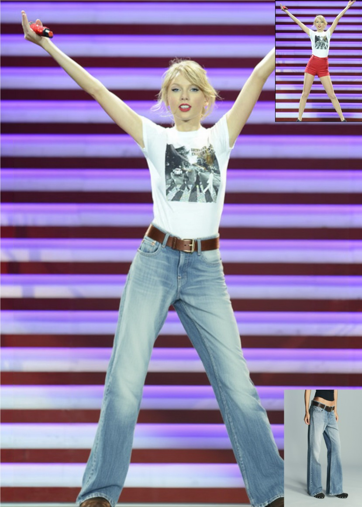
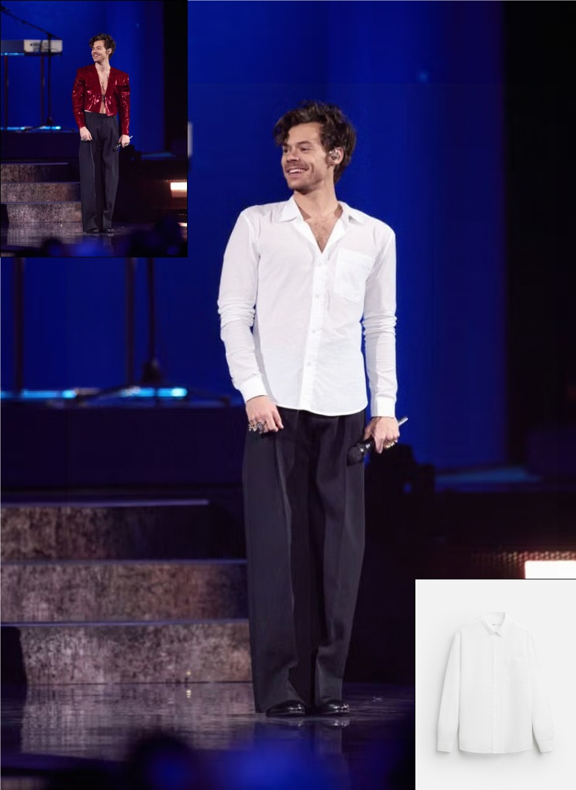
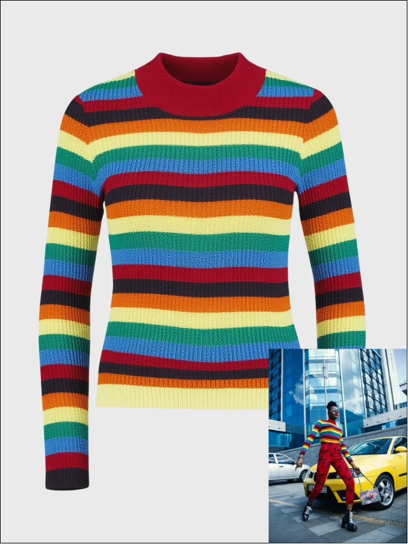

<div align="center">
<h2>Voost: A Unified and Scalable Diffusion Transformer for Bidirectional Virtual Try-On and Try-Off
</h2>

<a href="https://arxiv.org/abs/2508.04825"></a>
<a href="https://nxnai.github.io/Voost/"></a>
<a href="https://github.com/nxnai/Voost/blob/main/LICENSE">
</a>
<!-- <a href='https://huggingface.co/spaces/NXN-Labs/Voost'>
  
</a> -->

[Seungyong Lee<sup>*</sup></a>](https://ryan-seungyong-lee.github.io/)&emsp;&emsp;
[Jeong-gi Kwak<sup>*</sup></a>](https://jgkwak95.github.io/)<br><sup>* Equal contribution</sup><br>
**[NXN LABS](https://nxn.ai/)**
</div>

<p align="center">
  <br>
  <i>Voost</i> jointly handles <b>v</b>irtual try-<b>o</b>n and try-<b>o</b>ff within a <b>s</b>ingle <b>t</b>ransformer, achieving high-quality results while
  remaining robust to various human poses, garment categories, backgrounds, lighting conditions, and image compositions.
</p>

## News
- [2025-08-08] 📄 Voost is now on [arXiv](https://arxiv.org/abs/2508.04825). Visit the [project page](https://nxnai.github.io/Voost/) for more details and results.

## Demo <a href="https://huggingface.co/spaces/NXN-Labs/Voost"></a>

<div align="center">
  
  
  
  
  
</div><br>

🚧 A public demo (try-on & try-off) will be released soon. Stay tuned!

## Citation

```bibtex
@article{lee2025voost,
  author  =   {Seungyong Lee and Jeong-gi Kwak},
  title   =   {Voost: A Unified and Scalable Diffusion Transformer for Bidirectional Virtual Try-On and Try-Off},
  journal =   {arXiv preprint arXiv:2508.04825},
  year    =   {2025}
}
```

## License

This project is licensed under the [Creative Commons Attribution-NonCommercial-ShareAlike 4.0 International License](https://creativecommons.org/licenses/by-nc-sa/4.0/).

For commercial use, please visit [NXN Labs](https://nxn.ai/).

## Acknowledgments

Most models and clothing images used are from internet and public datasets (VITON, DressCode). All images and brands are the property of their respective owners.
